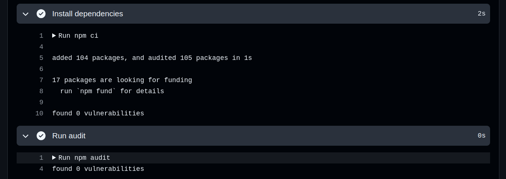
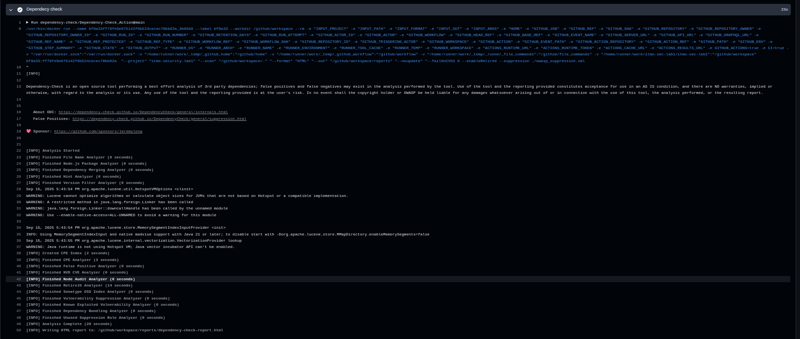
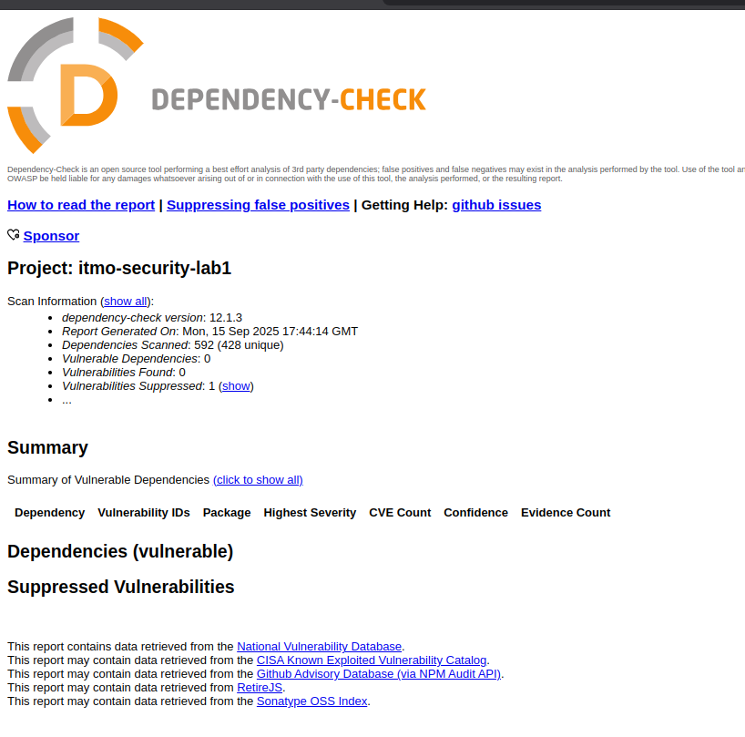

# Описание

Сервис позволяет создавать/входить в аккаунт и добавлять/просматривать пары ключ-значение.

```
npm install
npm run start
```

## Эндпоинты


### `GET /auth/register`
Страница с формой регистрации

### `POST /auth/register`
```
{ "username": "Alice", "password": "secret_password" }
```
Регистрирует нового пользователя. Тело запроса в виде multipart/form-data


### `GET /auth/login`
Страница с формой входа


### `POST /auth/login`
```
{ "username": "Alice", "password": "secret_password" }
```
Аутентифицирует пользователя, добавляя в cookies JWT. Тело запроса в виде multipart/form-data


### `GET /api/data`
Получить все хранимые пары в виде JSON


### `GET /api/data/:key`
Получить хранимое для ключа значение в виде JSON

### `GET /`
Получить страницу отображающих созданных пользователей и данные


### `POST /`
```
{ "key": "foo", "value": "bar" }
```
Получить страницу отображающих созданных пользователей и данные. Тело запроса в виде multipart/form-data

## Способы защиты

### SQL инъекция

Для защиты от SQL инъекции в коде используются только специальные параметризированные prepared statement. Если бы аргументы пользователя передавались через конкатенацию/интенрполяцию строк, то тогда пользователь мог бы сформировать ввод изменяющий структуру запроса.

### XSS инъекция

При любой вставке пользовательских данных в HTML используется функция `encodeURIComponent`, которая экранирует любые специальные символы. Таким образом пользователю не позволяется влиять на структуру/поведение HTML.

### Аутентификация

Реализована через JWT (Json Web Token), которые отдается пользователю в cookies при логине. В payload-е токена записано имя пользователя. "Секрет" для подписания токена указывается в `.env` файле. Все эндпоинты кроме `/auth/*` защищенны middleware подтверждающим корректность JWT у пользователя.

# Отчеты





